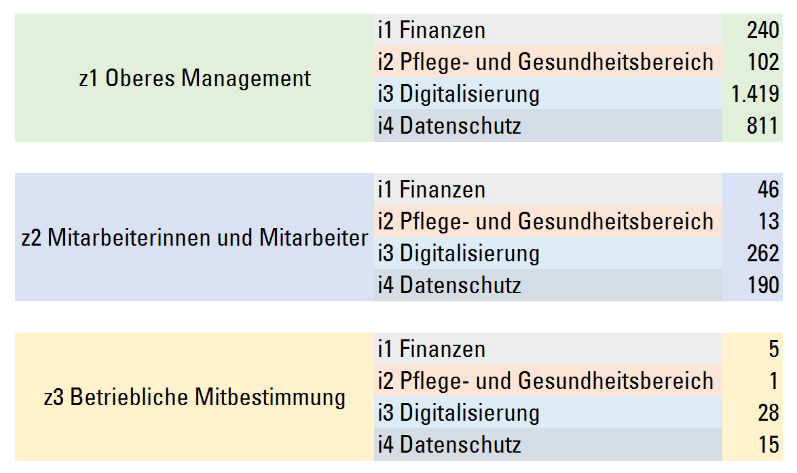
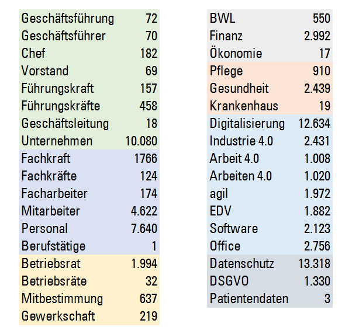
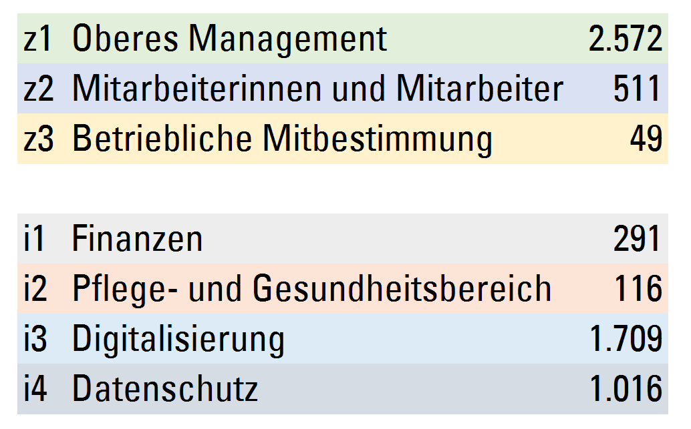
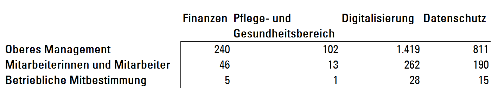
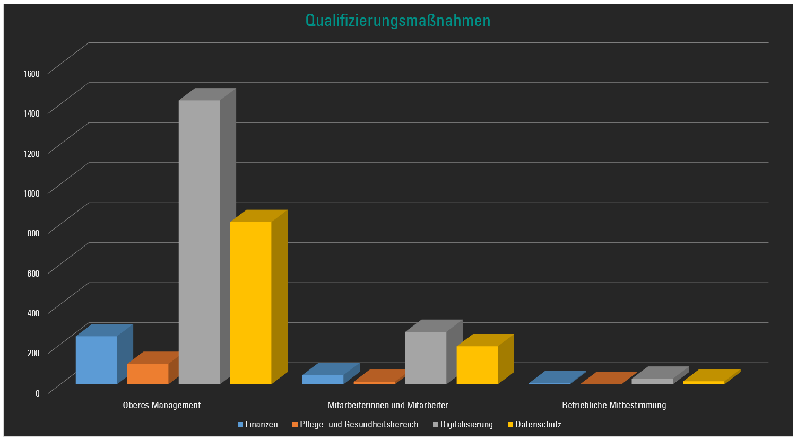
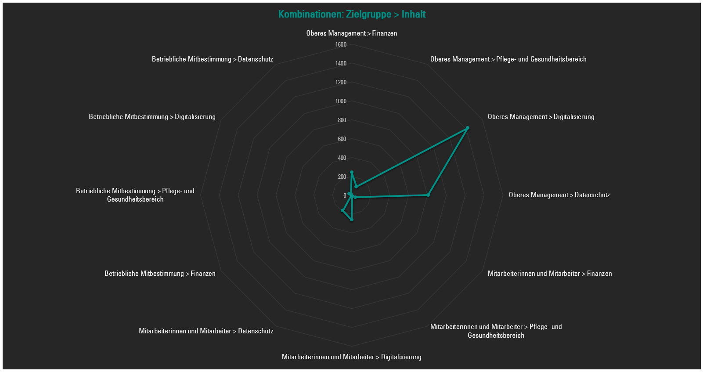

## Erhebung und Auswertung von Qualifizierungsmaßnahmen
---

by [u/creativeMan](https://www.reddit.com/r/ProgrammerHumor/comments/5ylndv/so_thats_how_they_did_it_its_brilliant/)
---
```java
if(goingToCrashIntoEachOther) { 
    dont(); 
}
```
by [u/Skizm](https://www.reddit.com/r/ProgrammerHumor/comments/5ylndv/so_thats_how_they_did_it_its_brilliant/)
---
## Gliederung
1. Datenbank
2. Vorgehen
3. Ergebnisse
---
## Datenbank
* iwwb.de
* 'Die Suchmaschine des Deutschen Bildungsservers für Weiterbildungskurse'
* 11.210 Einträge
---
## Vorgehen
1. Download der Ergebnisse
2. Durchsuchen nach Stichwörter
3. Quantitative deskriptive Auswertung
---
* Abfrage der Datenbank: Stichwort 'Digitalisierung' und Startdatum 'Juni 2019'
* Manipulation der Anzeige
* Download des Source-Codes
---
* manuelle Bereinigung via Text-Editor
* Transformation zu 'eine Information pro Zeile'
* .csv > .json
---
### iwwb-download.py
* Python3-Applikation
* [github.com](https://github.com/maximiliankolb/iwwb-qm/blob/master/iwwb-download.py)
---
```python
# parse json file to retrieve qm & download individual results to iwwb-qm/
# 2019-05-13 by maximilian

import urllib.request
from datetime import datetime
import json
import time

pathJson = 'iwwb-source.json'
pathFolder = 'iwwb-qm/'

json_file = open(pathJson, 'r')
json_file_content = json_file.read()
json_arrays = json.loads(json_file_content)

for quali in json_arrays['qm']:
	myFilenameDate = datetime.now().strftime("%Y-%m-%d_%H-%M-%S")
	myQmTitle = str(quali['qmTitel'])
	myFilename = myFilenameDate + '_' + myQmTitle + '.html'
	myDownloadPath = pathFolder + myFilename

	myUrl = quali['qmQuelle']
	print(myUrl, myDownloadPath)
	time.sleep(1)

	try:
		urllib.request.urlretrieve(myUrl, myDownloadPath)
	except Exception:
		print ('error', myUrl)
```
@[1-7]
@[8-14]
@[16-29]
---
### iwwb-auswertung.py
* Python3-Applikation
* [github.com](https://github.com/maximiliankolb/iwwb-qm/blob/master/iwwb-auswertung.py)
---
```python
# search files in iwwb-qm/ for keywords
# 2019-05-24 by maximilian

import os

keywords = ['Geschäftsführung', 'Geschäftsführer', 'Chef', 'Vorstand', 'Führungskraft', 'Führungskräfte', 'Geschäftsleitung', 'Unternehmen', 'Fachkraft', 'Fachkräfte', 'Facharbeiter', 'Mitarbeiter', 'Personal', 'Berufstätige', 'Betriebsrat', 'Betriebsräte', 'Mitbestimmung', 'Gewerkschaft', 'BWL', 'Finanz', 'Ökonomie', 'Pflege', 'Gesundheit', 'Krankenhaus', 'Digitalisierung', 'Industrie 4.0', 'Arbeit 4.0', 'Arbeiten 4.0', 'agil', 'EDV', 'Software', 'Office', 'Datenschutz', 'DSGVO', 'Patientendaten']

pathFolder = 'iwwb-qm/'

for fileName in os.listdir(pathFolder):
    list_numbers = ['']

    for keyword in keywords:
        i = 0
        fileHtml = pathFolder + fileName
        searchfile = open(fileHtml, "r", encoding = "ISO8859-1")

        for line in searchfile:
            if keyword.casefold() in line.casefold():
            # casefold to ignore upper and lower case
                i = i+1

        list_numbers.append(str(i))
    numbers = '|'.join(list_numbers)
    # separate numbers by '|'
    beautifulOutput = fileName + numbers
    print(beautifulOutput)

    searchfile.close()
```
@[1-8]
@[10-16]
@[18-29]
---
### Stichwörter > Dimensionen
---
**Dimension 'Oberes Management'**
* Geschäftsführung
* Geschäftsführer
* Chef
* Vorstand
* Führungskraft
* Führungskräfte
* Geschäftsleitung
* Unternehmen
---
**Dimension 'Mitarbeiterinnen und Mitarbeiter'**
* Fachkraft
* Fachkräfte
* Facharbeiter
* Mitarbeiter
* Personal
* Berufstätige
---
**Dimension 'Betriebliche Mitbestimmung'**
* Betriebsrat
* Betriebsräte
* Mitbestimmung
* Gewerkschaft
---
**Dimension 'Finanzen'**
* BWL
* Finanz
* Ökonomie
---
**Dimension 'Pflege- und Gesundheitsbereich'**
* Pflege
* Gesundheit
* Krankenhaus
---
**Dimension 'Digitalisierung'**
* Digitalisierung
* Industrie 4.0
* Arbeit 4.0
* Arbeiten 4.0
* agil
* EDV
* Software
* Office
---
**Dimension 'Datenschutz'**
* Datenschutz
* DSGVO
* Patientendaten
---

---
### Auswertung der Ergebnisse
---

---

---

---
## Kombinationen
---

---

---
# Danke
---
* Maximilian Kolb
* Präsentation am 28. Mai 2019
* BSD 3-Clause License
* Danke an github.com & gitpitch.com
* [github.com/maximiliankolb/iwwb-qm](https://github.com/maximiliankolb/iwwb-qm)
---
# Q&A
---
